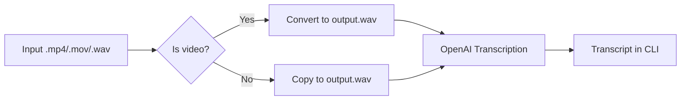

# Transcriber

Transcriber is a lightweight command-line utility that converts video or audio files into text using OpenAI's transcription models. It automatically converts `.mp4` or `.mov` files into a `wav` audio track and then sends the audio to the OpenAI API for transcription.

## Features
- Convert video files to mono 16 kHz WAV using `ffmpeg`.
- Send audio files directly to OpenAI's `gpt-4o-transcribe` model.
- Print the resulting transcript to the console.

## Prerequisites
- Python 3.8+
- [`ffmpeg`](https://ffmpeg.org/) installed and available on your `PATH`.
- An [OpenAI API key](https://platform.openai.com/) stored in a `.env` file as `OPENAI_API_KEY`.

## Installation
```bash
pip install -r requirements.txt
```

## Usage
1. Place your media file in the project directory.
2. Run the script:
   ```bash
   python transriber.py
   ```
3. Enter the file name when prompted. The script will create `output.wav` and display the transcript.

## Architecture


## Environment Variables
Create a `.env` file in the project root with your OpenAI key:
```bash
OPENAI_API_KEY=your_api_key_here
```

## License
This project is licensed under the MIT License - see the [LICENSE](LICENSE) file for details.

## Contributing
Pull requests are welcome. For major changes, please open an issue first to discuss what you would like to change.
